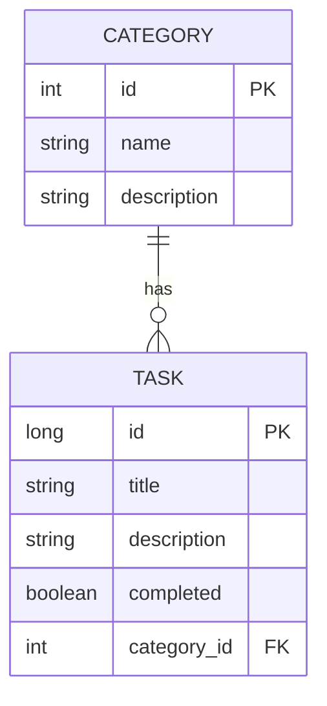

# sistema de ToDoList  

Desenvolvendo uma API de ToDoList para gerenciar requisições simples com categorias temáticas específicas.
API desenvolvida para atender um estado simples de uma aplicação Rest.

## 🛠 Tecnologias

As seguintes tecnologias foram utilizadas no desenvolvimento da API Rest do projeto:

- **Java 21**
- **Spring-boot**
- **Docker**
- **PostgreSQL**

---

## Mermaid

## 📝 Credito

Projeto desenvolvido por [JonasSmendes](https://repositorio-jonas-mendes.vercel.app/).
